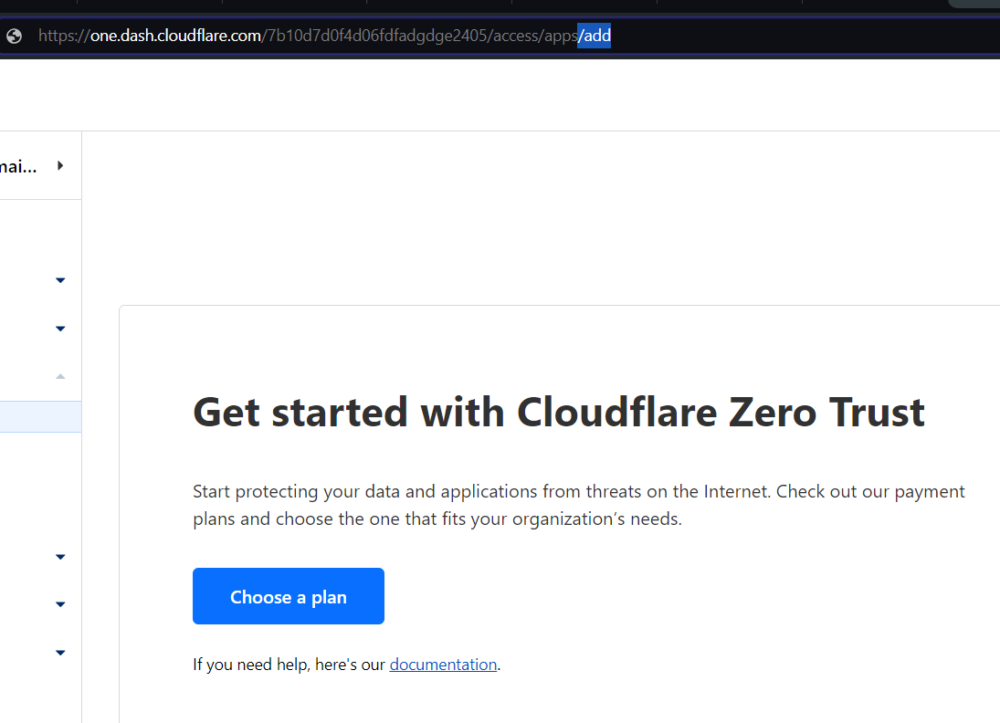
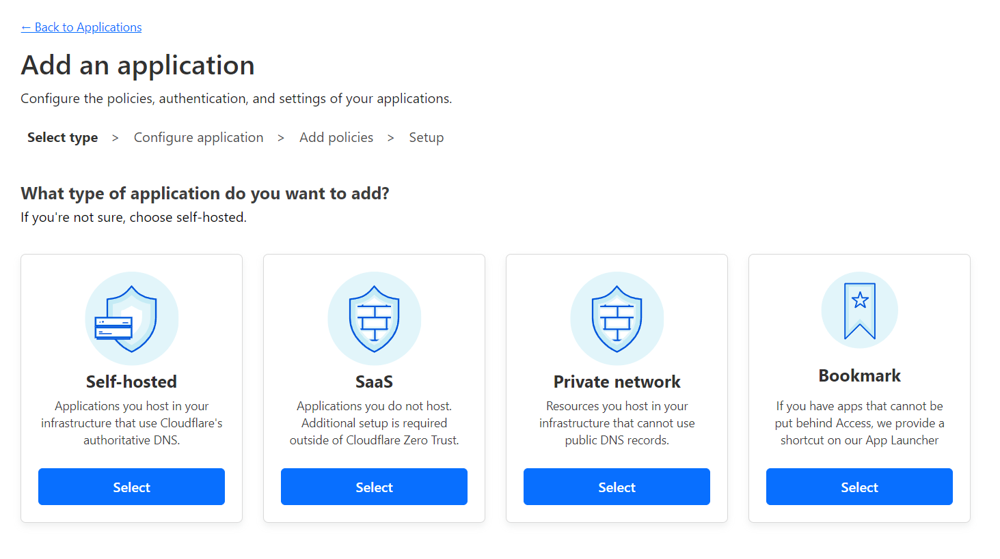

Whenever you try to add new application without payment method, Cloudflare doesn't let you move forward without adding one.


**There is simple work around this page. You just need to include, /add at the end of your URL and Volah !!!**

```rhtml
https://one.dash.cloudflare.com/7b10d7d0fdgeae343abdbd59e2405/access/apps/add
```



Now you can add application as per you requirement.


