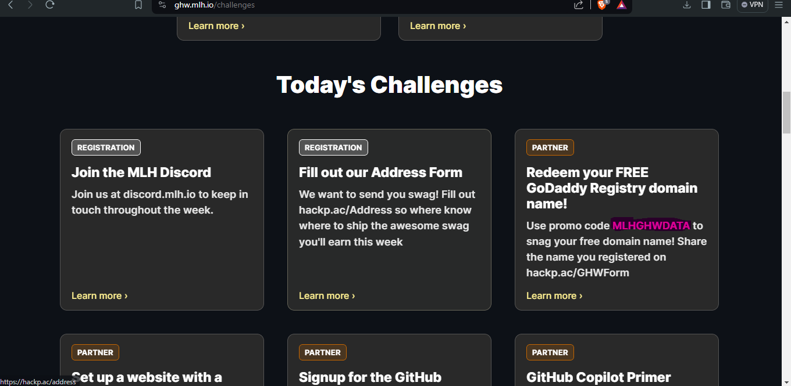
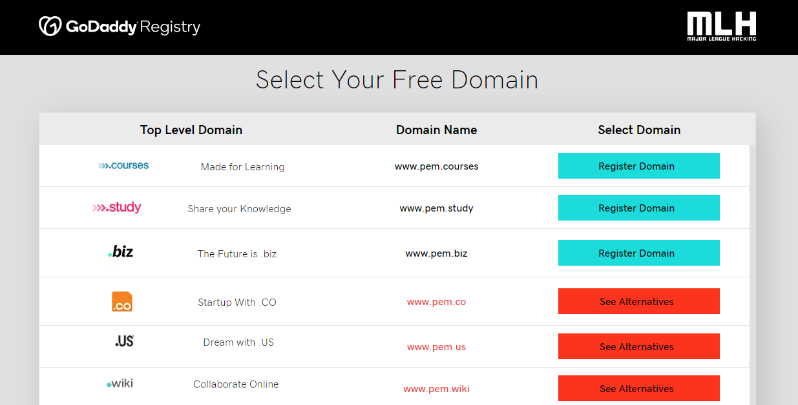
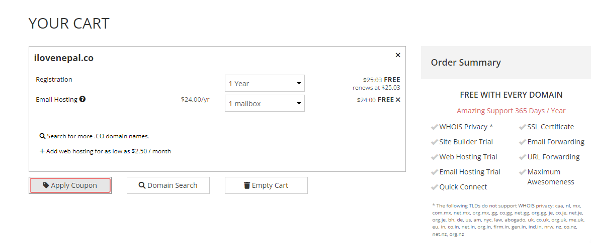

Claim your free .co .us .biz .study .courses .club and many more through MLH challenges for free. MLH stands for Major League Hacking, which is a global organization that empowers hackers (tech enthusiasts and innovators) through community events, education, and resources to explore, learn, and create using technology.

MLH in partnership with [porkbun](www.porkbun.com) and [GoDaddy Registry](https://www.tech.study/) provides free domains for all the hackers out there during [MLH events](https://mlh.io/events)

You can get various TLD (Top-Level Domain) through MLH domain coupons, like (**.co, .biz, .courses, .study, .us, .wiki, .design, .club, .compare and .select.** )

You can follow the following steps to get free domain :

## 1. Claim your free porkbun coupon code.

Visit [`https://ghw.mlh.io/challenges`](https://ghw.mlh.io/challenges) and scroll down to today's challenges. There you can find promo code to claim free domain.

## 2. Check domain availability.

Availability of domain can be checked from [`https://www.tech.study/`](https://www.tech.study/)

Enter name you that you want for your website, and it will show all available domains with that name. Note down full domain name and proceed to next step.

## 3. Checkout your free Domain.

In order to get your desired domain from that list, visit [`www.porkbun.com`](www.porkbun.com) and create an account.
Search for the exact domain, and proceed to checkout, applying the coupon we obtained from MLH. If the domain is flagged as premium, our coupon code cannot be used.

Enjoy your free domain !!

If you have any queries, feel free to contact us on [`https://discord.gg/RDU62RrFe3`](https://discord.gg/RDU62RrFe3)

## FAQ

**1. Porkbun Error : We are unable to apply coupon. Perhaps it's already been applied ?**  
This error might appear if you are trying to apply a coupon to premium domains. We cannot apply our coupon to domains flagged as premium.

**2. Internet Error while checking out domain.**  
You might encounter an internet error while checking out a domain on certain networks.If so, either you can use VPN ([Cloudflare Warp](https://one.one.one.one/)) or switch to any other networks.

## Which subdomains should I choose ?

1. **.co** : The domain for innovators, entrepreneurs, startups, and creators growing their extraordinary ideas online. It’s a space for inspiration, innovation, taking risks, hustling hard and turning ideas into reality.
2. **.biz** : In this wide-open digital world, .biz stands out as the no frills, straightforward, global TLD that’ll help you kickstart your digital presence. The future of business is here, be a part of it with a .biz domain.
3. **.us** : The web address of choice for anyone with a dream to chase, an idea to share, a cause to champion, or a business to promote. .US welcomes businesses based inside and outside the USA.
4. **.club** : .club is the ideal domain for the social world we live in. Whether it’s a party of 2 or 2000, there’s never been a better time to come together around a common passion and be a part of a club.
5. **.wiki** : Wikis are a uniting force for people with similar interests, and a .wiki domain name invites collaborative energy to your website.
6. **.study** : Empower a global learning community with your research today. A .study domain name is your place online to share your studies and connect with others to promote research, education and learning.
7. **.compare** : Whether you’re an influencer, a blogger or an enthusiastic reviewer, .compare is the online destination for people with knowledge, expertise or experience to help others make informed decisions.
8. **.select** : Your customers know they can select the best on your site with a .select domain. Positions your website as quality right from the start and ensures your users see it as distinct and a class apart.
9. **.design** : A .design domain name lets people know what you do before they even arrive at your website. A .design domain allows you to create a more succinct, powerful, and elegant URL for your business or portfolio.
10. **.courses** : Connect students directly to education courses. Whether you’re a training provider, educational institution, .courses is the quick, easy and memorable way to market your services online.
