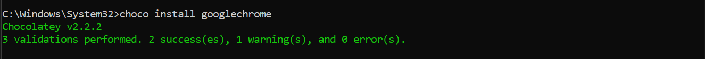

<!--StartFragment-->

Installing software can be time-consuming. You have to search for the program, download it, and then manually install it, often with unwanted packages bundled in.

To skip these steps, try Chocolatey. It's a command-line package manager for Windows that makes software management easier. It can install, upgrade, remove, and configure applications, saving you time.

To install and set up Chocolatey on Windows, follow these steps:

### **1. Open CMD as Admin :**


### **2.** **Install Chocolatey**:

Run the following command in the command prompt:

```cmake
@"%SystemRoot%\System32\WindowsPowerShell\v1.0\powershell.exe" -NoProfile -InputFormat None -ExecutionPolicy Bypass -Command "iex ((New-Object System.Net.WebClient).DownloadString('https://chocolatey.org/install.ps1'))" && SET "PATH=%PATH%;%ALLUSERSPROFILE%\chocolatey\bin"
```

### **3. Verify Installation:**


### **4. Usage:**

Let's install GoogleChrome using Chocolatey.



If you are unsure about package name, you can check that in

```
https://community.chocolatey.org/packages
```

So why wait? Dive into the world of Chocolatey today and revolutionize the way you manage software on Windows. Say goodbye to manual installations and hello to a faster, more streamlined approach with Chocolatey. Your software management journey starts here!

<!--EndFragment-->
